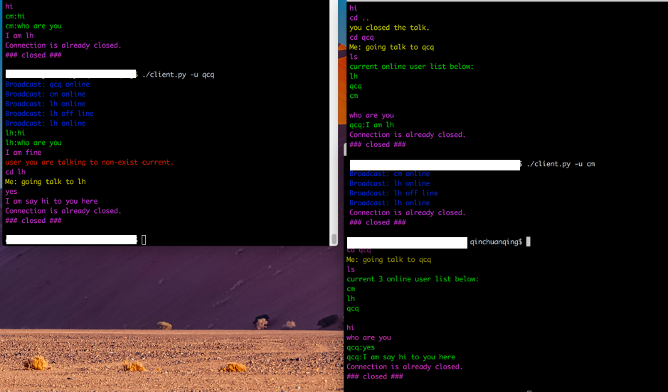

# Chat

Chat is one app which try to implement the C/S archecture.  
Chat is based on the websocket as the message channel which makes the coding simple.  
Right now, This is just a scrach project which just begin.  
By now, the server side first version finished--just with the feature of text-based streaming with tls support. for test reason implement one python version cient which test the server side.

## Software looks below



## Description

The Software use the string from the start to end, The server receive the string, and check the string if has the command of **ls** or **cd**, or usual message.  
**ls** means let the server gives the currnet online users.   

* *ls*, just ls will list all current online users.
* *ls username1, username2 ...* will list the queried user, if they exist.

**cd** has below behiviours

* *cd ..*, means exit the communication with the current user
* *cd username*, means the current switch the channel to the wanted talking online user
    
**ususal** the common message

* common message, which will route to the user which want to talk.


The Software not need the registeration liked things. for right now, just need the userself to give a user name when they use this commandline app.

For detail info can reference the doc of project which not exist right now.


## How to install

### Server side

1. git clone this project
```
git clone https://github.com/qcq/Chat.git
```
2. cd to Chat path or the name which you give it.
```
cd Chat
```
3. create the build directory
```
mkdir build
```
4. produce the makefiles with cmake
```
# ensure the cmake version >= 3.17
cmake ..
```
5. build the project
```
# ensure the gcc/clang support the c14
make
```
6. for ut
```
make ut
```
7. run ut
```
make ut-run
```
8. after above producre, the binary of ChatServer is in Chat/bin/ path
```
# run the binary
# under the build path just execute below command
../bin/ChatServer
```
9. The server is waiting the client side to connect at port 7890 at now.

### client side

The client side has not implement in C++, which for test, provide one python version which located in src/pys.  

just use below command to run it.

```
./client.py -u username
```

## embeded tech

* websocket

    come to this time, when I check more options for C++ version of websocket, there exist boost.beast
    except the websocketpp, but seems boost version is not easy to understand. But, I inisit to learn
    it with patience.

    current version is written in websocketpp, may be one ay re-write it in boost.

* cmake

    apparently, this is cmake project.

* gtest

    introduce ut with gtest.

* emake https://github.com/skywind3000/emake

    seems this compile method is more simpler than cmake, just need include main.mak, not update the main.mak in time.

* consider add the support of protocal buf of google

* spdlog https://github.com/gabime/spdlog

    with spdlog to logging the log of project

## Hope for myself

## I hope I will insist on this project, which can be one behalf project of mine
